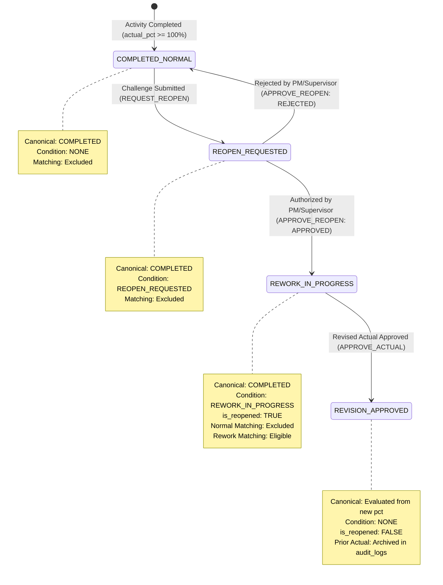

# SETUAI V7 — PHASE 7 IMPLEMENTATION REPORT

## Reopen / Rework Workflow + Actuals Revision Engine

**Member 1 — Core Execution Intelligence**  
**Repository:** `SIH26122_v2` (V7 Target)  
**Status:** Verification Passed & Integrated  
**Date:** 2026-09-28  

---

## 1. Executive Summary & Gates

Phase 7 of the SETUAI V7 Architecture has been successfully implemented, rigorously verified against the live PostgreSQL database instance, and validated with zero regressions against all prior phases (Phases 0–6).

The central objective of Phase 7 is:
> **Allow a legitimately completed activity to be explicitly challenged, human-authorized for reopening, processed through rework, and eventually receive a corrected approved actual without destroying the historical approved record.**

The implementation strictly satisfies all core engineering postures:
1. **Deterministic State Invariants:** Canonical Execution State (`NOT_STARTED`, `IN_PROGRESS`, `COMPLETED`) is strictly separated from operational `WorkflowCondition` (`NONE`, `REOPEN_REQUESTED`, `REWORK_IN_PROGRESS`, `QUALITY_HOLD`, `BLOCKED`).
2. **Historical Immutability & Reconstructibility:** Approved actuals revisions never silently destroy or overwrite past approved states. Prior approved actuals are immutably archived into `audit_logs` with SHA-256 tamper-evident hash chaining, linked to append-only `planner_decisions` rows.
3. **Controlled Rework Matching:** Normal execution matching continues to exclude completed and rework activities. A dedicated, server-validated rework context (`is_rework=True`) permits matching strictly for activities in authorized `REWORK_IN_PROGRESS`.
4. **Defense-in-Depth RBAC:** Reopening requests can be submitted by `OWNER`, `PROJECT_MANAGER`, `SUPERVISOR`, and `SITE_ENGINEER`. Reopen authorization (`APPROVE_REOPEN`) is restricted to `OWNER`, `PROJECT_MANAGER`, and `SUPERVISOR`, explicitly preventing Site Engineers from self-authorizing rework.
5. **Zero Mod-Drift on Legacy V6:** The reference repository `D:\SIH26122` remains 100% clean and unmodified.

```text
PHASE 5 COMPLETE.
PHASE 6 COMPLETE.
PHASE 7 COMPLETE.
PHASE 8 NOT STARTED.
```

---

## 2. Architecture & State Machine

### 2.1 Dual-Track State Separation
Canonical execution state answers **"What is the physical reality?"**, whereas workflow condition answers **"What operational governance applies?"**:

```
+---------------------------------------------------------------------------------------------------+
| PHYSICAL REALITY (Canonical State)                                                                |
|   actual_pct_complete >= 100.0  ──> COMPLETED                                                     |
|   actual_start IS NOT NULL      ──> IN_PROGRESS                                                   |
|   else                          ──> NOT_STARTED                                                   |
+---------------------------------------------------------------------------------------------------+
| OPERATIONAL GOVERNANCE (Workflow Condition)                                                       |
|   reopen_status == 'REQUESTED'                   ──> REOPEN_REQUESTED                             |
|   is_reopened == TRUE or status == 'APPROVED'    ──> REWORK_IN_PROGRESS                           |
|   unresolved quality gates                       ──> QUALITY_HOLD                                 |
|   impediment / blocked flag                      ──> BLOCKED                                      |
|   normal flow                                    ──> NONE                                         |
+---------------------------------------------------------------------------------------------------+
```

### 2.2 Reopen Lifecycle State Transitions



---

## 3. Immutability & Reconstructibility Proof

Because `approved_actuals` maintains a unique constraint on `(schedule_id, activity_id)`, revised actuals are processed through an atomic transaction with full historical snapshotting:

1. **Lock Row:** `SELECT ... FROM approved_actuals WHERE schedule_id = %s AND activity_id = %s FOR UPDATE;`
2. **Snapshot Prior State:** Full dictionary serialization of existing approved actual (`actual_start`, `actual_finish`, `actual_pct_complete`, `actual_quantity`, `decision_id`, `created_at`, `reopened_at`, `rework_notes`).
3. **Record Immutable Decision:** Insert new append-only row into `planner_decisions` (`action='REVISION'`, `planner_id=user_id`, `justification=revision_notes`).
4. **Update Authoritative Row:** Update `approved_actuals` with revised metrics, reset `is_reopened=FALSE`, append revision notes.
5. **Tamper-Evident Audit Ledger:** Insert entry into `audit_logs` with `action='ACTUAL_REVISION_APPROVED'`, containing `before_state` (exact prior actual snapshot) and `after_state` (revised actual), cryptographically chained via SHA-256.
6. **Timeline Reconstruction:** `ReopenService.get_actual_history` reconstructs the entire chronological timeline by combining:
   - Current authoritative record from `approved_actuals`
   - Historical approved snapshots from `audit_logs`
   - Reopen request and decision events from `execution_events`
   - Rework field claims from `execution_events` (`reopened_from_actual_id IS NOT NULL`)
   - Tamper-evident audit trail entries

---

## 4. RESTful API Surface

Registered in `backend/routers/reopen.py` and mounted in `backend/main.py`:

| Method | Route Pattern | Permission | Description |
|---|---|---|---|
| `POST` | `/api/v1/projects/{proj_id}/schedules/{sched_id}/activities/{act_id}/reopen` | `REQUEST_REOPEN` | Challenge and request reopening of a completed activity. |
| `POST` | `/api/v1/projects/{proj_id}/schedules/{sched_id}/activities/{act_id}/reopen/decide` | `APPROVE_REOPEN` | Authorize (`APPROVED`) or dismiss (`REJECTED`) a reopen request. |
| `POST` | `/api/v1/projects/{proj_id}/schedules/{sched_id}/activities/{act_id}/actuals/revision` | `APPROVE_ACTUAL` | Approve corrected actuals post-rework, archiving prior record. |
| `GET` | `/api/v1/projects/{proj_id}/schedules/{sched_id}/activities/{act_id}/reopen` | `VIEW_SCHEDULE` | Get current reopen lifecycle status and context. |
| `GET` | `/api/v1/projects/{proj_id}/schedules/{sched_id}/activities/{act_id}/history` | `VIEW_SCHEDULE` | Reconstruct complete execution and revision timeline. |

*(All routes also support header/query-scoped format `/api/v1/projects/{proj_id}/activities/{act_id}/...` via `ScheduleContext`)*

---

## 5. Downstream Contracts for Phase 8

`backend.services.reopen_service.ReopenService` exports stable, deterministic contracts for downstream engines:

```python
class ReopenService:
    @classmethod
    def get_current_approved_actual(cls, context: ScheduleContext, activity_id: str) -> Optional[Dict[str, Any]]: ...

    @classmethod
    def get_actual_history(cls, context: ScheduleContext, activity_id: str) -> Dict[str, Any]: ...

    @classmethod
    def get_reopen_status(cls, context: Union[ScheduleContext, ProjectContext], activity_id: str) -> Dict[str, Any]: ...

    @classmethod
    def get_workflow_condition(cls, activity_data: Dict[str, Any]) -> str: ...

    @classmethod
    def is_activity_reopened(cls, activity_data: Dict[str, Any]) -> bool: ...

    @classmethod
    def get_activity_execution_context(cls, context: ScheduleContext, activity_id: str) -> Dict[str, Any]: ...
```

---

## 6. Verification & Test Suite Summary

### 6.1 Database Schema Verification
Executed via `python -m backend.models.verify_v7_schema`:
- **Tables (30 total, 29 domain):** ALL PASSED
- **Extended Columns (schedules, activities, dependencies, events, actuals, audit):** ALL PASSED
- **Foreign Keys (56 constraints):** ALL PASSED
- **Row Level Security (29 domain tables):** ALL PASSED
- **Security Policies (54 policies, 0 NULL bypasses):** ALL PASSED
- **Performance Indexes (97 indexes):** ALL PASSED
- **Orphan / Null Project ID Integrity Check:** ALL PASSED (0 null rows)

### 6.2 Focused Phase 7 Test Suite
Executed via `python -m pytest tests/test_phase7_*.py -v`:
- `test_reopen_request_success_site_engineer`: PASSED
- `test_reopen_request_rejected_on_in_progress`: PASSED
- `test_reopen_request_duplicate_rejected`: PASSED
- `test_reopen_decision_site_engineer_forbidden`: PASSED
- `test_reopen_decision_pm_reject`: PASSED
- `test_reopen_decision_pm_approve`: PASSED
- `test_normal_matching_excludes_rework_in_progress`: PASSED
- `test_rework_matching_permits_rework_in_progress`: PASSED
- `test_rework_matching_strictly_excludes_unopened_completed`: PASSED
- `test_rework_matching_router_exact_id`: PASSED
- `test_actual_revision_happy_path`: PASSED
- `test_reconstructible_history_endpoint`: PASSED
- `test_revision_rejected_when_not_in_rework`: PASSED
- `test_cross_project_isolation`: PASSED
- `test_cross_schedule_isolation`: PASSED
**Result:** **15 passed, 0 failed (100% green)**

### 6.3 Phase 5 & Phase 6 Backward Compatibility Regression Suite
Executed via `python -m pytest tests/test_phase5_*.py tests/test_phase6_*.py -v`:
- `tests/test_phase5_execution_state.py`: 5 passed
- `tests/test_phase5_stage_domain.py`: 3 passed
- `tests/test_phase5_stage_isolation.py`: 4 passed
- `tests/test_phase5_stage_state.py`: 4 passed
- `tests/test_phase6_completed_exclusion.py`: 5 passed
- `tests/test_phase6_matching_eligibility.py`: 3 passed
- `tests/test_phase6_stage_scoping.py`: 3 passed
**Result:** **27 passed, 0 failed (100% green)**

### 6.4 Repository Isolation
- V6 Mirror (`D:\SIH26122`): Verified clean, 0 files modified.

---

```text
PHASE 5 COMPLETE.
PHASE 6 COMPLETE.
PHASE 7 COMPLETE.
PHASE 8 NOT STARTED.
```
